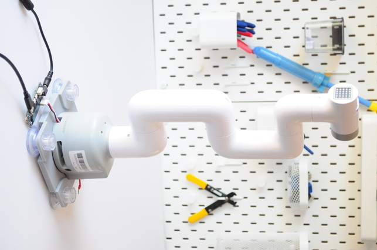

# open-cobot280
An attempt at open firmware for the myCobot280 from Elephant Robotics, with a serial console interface. 



&nbsp;
# Video

| Demo1 | Demo2 | Rainbow |
| :---:        |     :---:      |          :---: |
|  |  |     |

&nbsp;

# Warning

This is an initial attempt at open firmware, and requires modifying your myCobot280.  You should not attempt this unless you are comfortable performing each step.  Moveover, the firmware is experimental and largely untested and unverified -- its use (or misuse) may cause harm to person or property.

Moreover, robotics (in specific), and electronics (in general) can be dangerous.  The myCobot280 is suprisingly powerful, and also needs to be very firmly anchored to some stationary base.  You should have a setup that includes some method (like an `emergency stop button`) of instantly being able to disconnect the power to the robot instantly if something goes wrong.

No warranty of any kind is provided -- use at your own risk. 

# myCobot280

The myCobot280 is an inexpensive robot arm sold by [Elephant Robotics](https://www.elephantrobotics.com/en/).  It has great promise for a variety of applications (including research), but I struggled getting the firmware or Python APIs working on both the Raspberry Pi and M5 versions.  This is an attempt at writing open firmware for the controller, to get around the issues I was struggling with.

### Structure
The myCobot280 is a 6-axis device.  From disassembly, as best as I can infer:
- The first 5 servos are STS3215 or compatible
- The end-effector servo appears to be a STS3032, supporting continuous 360 degree rotation
- There is a microcontroller (the "atom") provided in the end effector, which includes a display and some GPIO
- Everything appears controlled by a shared Serial Servo Bus. 

### Controller 

The `Waveshare ESP32 Serial Bus Servo Driver` that I purchased came with open source firmware, but this appeared to be primarily for controlling "SC" type servos, and had unexpected behavior when using "ST" type servos (though their firmware does appear to support these, with modification).

The firmware in this repository is indended for the waveshare controller, but is designed specifically for the myCobot280. 

# Setup

This firmware is intended for use with the inexpensive [WaveShare "Servo Driver with ESP32"](https://www.waveshare.com/wiki/Servo_Driver_with_ESP32).

It requires modifying the myCobot280 by unplugging the servo in the base from the native controller (e.g. Raspberry Pi) and plugging it into the WaveShare ESP32 controller.

Using an appropriate power supply is required.  The supply that came with my myCobot280 was labelled as 8.4V, while the cobot appears to have a supply in the base that lowers this voltage a bit.  The 8.4V supply appeared to work for me, but it's not clear whether this might overvoltage any of the servos (particularly the Feetech STS3032 that appears to be in the last stage).

The WaveShare driver can be flashed with the firmware using the Arduino IDE.  The board setting appears to be  "ESP32 Dev Board", with "PSRAM" set to `enabled`. 


# Usage

The firmware is controlled over the ESP32 serial port using a serial console.  You can either manually enter commands, or connect to it using your favorite programming language (e.g. `Python`) and send commands. 

### Start-up
At start-up, the firmware scans for servos by pinging them, and holding ("torquing") any servos that it finds at their current position.  The output on the serial console looks something like this:
```
Firmware name: OPEN_COBOT280
Firmware version: 0.1
Servo 0: No Response
Servo 1: Found
Servo 2: Found
Servo 3: Found
Servo 4: Found
Servo 5: Found
Servo 6: Found
Servo 7: No Response
Servo 8: No Response
Servo 9: No Response
OK
```

The `OK` signifies that the console is now available to take commands, as seen below.

### Available Commands
The available commands are as follows (this can be displayed by typing "help" into the serial console):
```
Commands                                   Description                         Example
----------------------------------------------------------------------------------------------------
Queue commands
 move servoId position speed accel         Queue a move command                move 1 1024 1000 100
 qoff servoId                              Queue an untorque command           qoff 1
 qtorque servoId                           Queue a torque command              qtorque 1
 go                                        Execute queued move commands        go
 clearqueue                                Reset the move queue                clearqueue

Instant commands
 off                                       Turn all servos off                 off
 torque                                    Torque (turn on) servos             torque
 stop                                      Stop all servos in position         stop
 ping                                      Detect/ping all servos              ping
 rgb r g b                                 Set color on ATOM display           rgb 0 255 0

Demos
 rainbow                                   Rainbow on ATOM display             rainbow
 center                                    Move all servos to 2048             center
 demo1                                     Move all servos back/forth          demo1
 demo2                                     Move all servos back/forth          demo2

Informational commands
 queue                                     Display all queued moves            queue
 status                                    Display all servo information       status
 status-tsv                                As above, but in TSV format         status-tsv
 version                                   Display firmware version            version
 help                                      Display this message                help
----------------------------------------------------------------------------------------------------
```

### Verifying status

You may first wish to verify that the firmware can find all the servos, as expected.  Type `status` (enter), and something like the following should appear, showing each of the servos and the most recently read information from them: 

```
Servo Status
servo:1 exist:1 error:0 position:2048 speed:0 load:0 voltage:84 current:1544 temp:33 mode:81 isMoving:0
servo:2 exist:1 error:0 position:2051 speed:0 load:0 voltage:84 current:1544 temp:34 mode:81 isMoving:0
servo:3 exist:1 error:0 position:2046 speed:0 load:0 voltage:84 current:1544 temp:35 mode:81 isMoving:0
servo:4 exist:1 error:0 position:2051 speed:0 load:33 voltage:82 current:1544 temp:43 mode:81 isMoving:0
servo:5 exist:1 error:0 position:2041 speed:0 load:1088 voltage:77 current:1544 temp:71 mode:81 isMoving:0
servo:6 exist:1 error:0 position:2051 speed:0 load:27 voltage:81 current:1544 temp:45 mode:81 isMoving:0
```

There is also a version of this command, `status-csv`, that outputs the status information in a delimited format, for easy parsing: 
```
servoId,doesExist,errorState,currentPosition,currentSpeed,load,voltage,current,temp,mode,isMoving
1,1,0,2048,0,0,84,0,33,81,0
2,1,0,2051,0,0,84,0,34,81,0
3,1,0,2046,0,0,84,0,35,81,0
4,1,0,2051,0,33,81,0,43,81,0
5,1,0,2041,0,1088,83,0,70,81,0
6,1,0,2051,0,27,85,0,45,81,0
OK
```

### Running demos

A first command to run (that doesn't involve any motion) is `rainbow`.  This will show a rainbow colour pattern on the ATOM display.

Two motion demos similar to the official myCobot280 demos are provided.  The `demo1` command moves each axis of the arm back and forth, one at a time.  The `demo2` command moves the arm in between some curled-up ball positions.  `center` brings the arm to approximately center position, and both `demo1` and `demo2` perform this before beginning their demos.


### Moving the arm
Nominally, motion commands are queued to the motors (using the `move`) command, then those queued commands are send to the motors after sending the `go` command. 

For example, let's move one of the motors toward the end of the effector by sending:
```
move 5 500 1000 100
```

This queues a `move` for servo `5`, moving to position `500`, at speed `1000` and acceleration `100`.  The firmware will then respond with a message that this motion has been queued:
```
servo:5 isValid:1 torque:1 justTorque:0 position:500 speed:1000 acceleration:100
Added move request to queue.
OK
```

Each servo can hold only a single queued motion at a time, and if you queue another move to that servo (before a `go` command), it will overwrite whatever is currently in the queue for that servo.  We can see whatever is in the current queue by using the `queue` command:

```
Servo 0  no request
Servo 1  no request
Servo 2  no request
Servo 3  no request
Servo 4  no request
Servo 5  servo:5 isValid:1 torque:1 justTorque:0 position:500 speed:1000 acceleration:100
Servo 6  no request
Servo 7  no request
Servo 8  no request
Servo 9  no request
OK
```

This shows that only a single servo has a queued motion.  To run the motion, type `go`. 

### Turning motors on/off

The command `off` will send the release command to all identified servos. 

Similarly, the command `torque` will send the torque command to all identified servos, holding them in place. 

The `stop` command quickly releases then torques each identified servo, effectively holding it in its current position.


### Discovering servos

When initialized, the firmware pings all expected servos.  If all expected servos don't respond to the ping, you should likely discontinue using the robot and see if there's a failure, since you may see unexpected behavior.

You can always re-ping (i.e. re-discover) servos using the `ping` command, which should see output like the following:
```
Servo 0: No Response
Servo 1: Found
Servo 2: Found
Servo 3: Found
Servo 4: Found
Servo 5: Found
Servo 6: Found
Servo 7: No Response
Servo 8: No Response
Servo 9: No Response
OK
```

If you have an end effector added, you may see more servos than just the 6 on the stock cobot. 

### Atom

Currently, the only supported ATOM command is setting the colour of the display.  This can be accomplished using the `rgb` command, which takes the red, green, and blue (0-255) settings as arguments.  For example, setting the display to green can happen using the command: `rgb 0 255 0`. 

The `rainbow` command cycles through the colours on the atom display.

# Frequently Asked Questions
Q: What is the servo position unit?
A: This is a good question.  As near as I have inferred, the range is 0-4096, with what should be considered a danger zone towards either end as the robot reaches the limits of its range of motion. 

Q: What are the speed and acceleration units?
A: This is also a good question, and I have no idea.  A speed of `1000` and acceleration of `100` seem modestly fast.  

&nbsp;
# Contact

Comments, questions, bug reports, and cool use-cases are welcome.  
For bug reports or issues, please use the Github issue tab. 

Contact information: `Dr. Peter Jansen <pajansen@arizona.edu>`.
Web: https://cognitiveai.org/
Twitter: https://twitter.com/peterjansen_ai

&nbsp;
# Paper Citation

Please cite the following:

```
```

# License
This work is licensed under the BSD 3-Clause license: 

```
Copyright 2023 Peter Jansen

Redistribution and use in source and binary forms, with or without modification, are permitted provided that the following conditions are met:

Redistributions of source code must retain the above copyright notice, this list of conditions and the following disclaimer.
Redistributions in binary form must reproduce the above copyright notice, this list of conditions and the following disclaimer in the documentation and/or other materials provided with the distribution.
Neither the name of the copyright holder nor the names of its contributors may be used to endorse or promote products derived from this software without specific prior written permission.
THIS SOFTWARE IS PROVIDED BY THE COPYRIGHT HOLDERS AND CONTRIBUTORS "AS IS" AND ANY EXPRESS OR IMPLIED WARRANTIES, INCLUDING, BUT NOT LIMITED TO, THE IMPLIED WARRANTIES OF MERCHANTABILITY AND FITNESS FOR A PARTICULAR PURPOSE ARE DISCLAIMED. IN NO EVENT SHALL THE COPYRIGHT HOLDER OR CONTRIBUTORS BE LIABLE FOR ANY DIRECT, INDIRECT, INCIDENTAL, SPECIAL, EXEMPLARY, OR CONSEQUENTIAL DAMAGES (INCLUDING, BUT NOT LIMITED TO, PROCUREMENT OF SUBSTITUTE GOODS OR SERVICES; LOSS OF USE, DATA, OR PROFITS; OR BUSINESS INTERRUPTION) HOWEVER CAUSED AND ON ANY THEORY OF LIABILITY, WHETHER IN CONTRACT, STRICT LIABILITY, OR TORT (INCLUDING NEGLIGENCE OR OTHERWISE) ARISING IN ANY WAY OUT OF THE USE OF THIS SOFTWARE, EVEN IF ADVISED OF THE POSSIBILITY OF SUCH DAMAGE.
```
